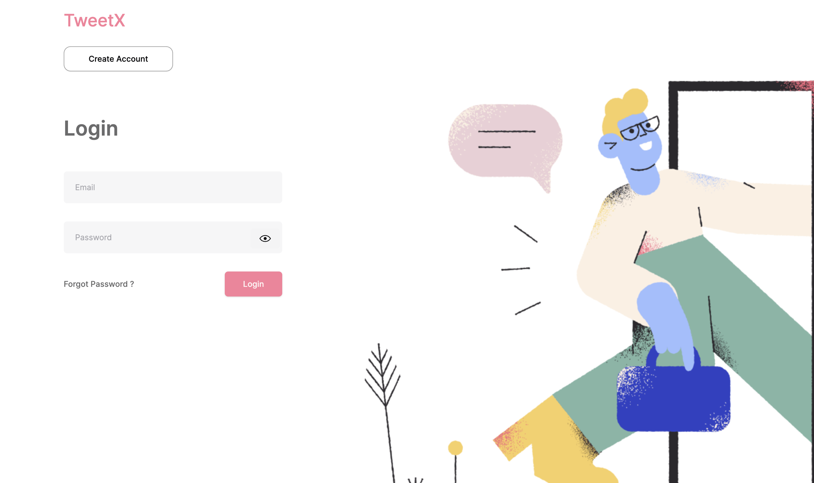

# TweetX

A demo micro blogging platform built using Next.js.

User operations

- A user sign up/login
- A user can post twitter like 2-sentence text post.
- A user can see his own list of posts
- A user can see list of other users
- A user can follow another user
- So if you follow 3 users, and each of them have posted 10 messages, a particular user's feed will show 30 messages in the order in which they were posted along with timestamps.

### Screenshot

## My Process

### Built with

- [React](https://reactjs.org/) - JS library
- [Next.js](https://nextjs.org/) - React framework
- [TailwindCSS](https://tailwindcss.com/) - CSS framework
- [ReactQuery](https://tanstack.com/query/latest) - State Management
- [ReactHookForm](https://react-hook-form.com/) - Form Validator
- [Drizzle](https://orm.drizzle.team/) - ORM
- [Turso](https://turso.tech/) - Sqlite Managed DB

### Design Summary

- The project was built using NextJs because it provides a convenient full-stack(ish) solution out of the box along with file based routing and simple database operations using React Server Components(RSC) where we can query the database securely in the server.

- I decided to pair the client side fetching with ReactQuery and 'server actions' to provide convenient fully type safe queries.

- The database was created using SQLite because it is portable, lightweight and also because Turso provides a generous free tier.

- The schema is managed using Drizzle ORM which provides easy to use sql like syntax to query the database.

## Author

- GitHub - [Saga-sanga](https://github.com/Saga-sanga)
- Frontend Mentor - [@Saga-Sanga](https://www.frontendmentor.io/profile/Saga-sanga)
- Twitter - [@RecksonKhiangte](https://twitter.com/RecksonKhiangte)
